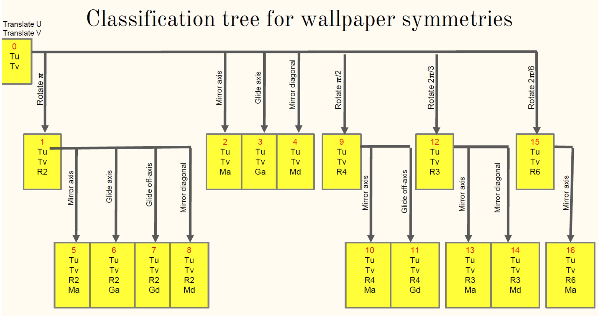
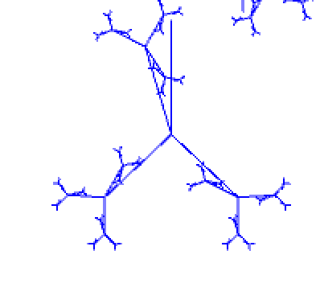

# Pattern

Authors: Jiaxi Xu(individual project)
Design an animated pattern, replicated it with translation, rotation, mirror and glide to make 17 patterns(0-16). Export a most aesthetic one as the texture of COTS transformation. 

## Objectives

part 1. Design an efficient interface to let the user create a simple triangle mesh. 
part 2. Given vertices, generates the Delaunay triangulation.
part 3. Texture mapping. COTS stands for Corner-Operated Tran-Similar. 
Notice: part 3 only invloves texture mapping. I learned about the COTS idea in part3 but its code is provided. 

## How to use
Open any file in part1_2_code folder with Processing, click on Run.
In the application, keep pressing '0' to see all 17 patterns.
"g" to show/hide background color
">" to show/hide corrdination unit vector
"G" to show/hide corrdination unit shape

## Explanation
part 1.
Implement mirror and glide function and create 17 patterns. 17 patterns follows the following rule

part 2.
Design my unit pattern. Mine is a recursive tree. It branches out by theta degrees and for animation, theta
changes with time in the range of [0, 60]

part 3.
export the pattern from part 1 & 2 and apply COTS

## Result
screen recordnig of the final result

#### part 1 & 2: 

#### part 3: 

## Resources
base code: CS4497/6497 Project 4 with Dr.Jarek Rossignac from Gatech

